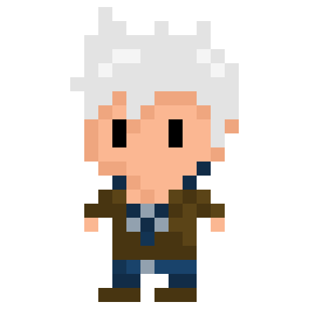

[![GithubLastCommit][last-commit-shield]][last-commit-url]


<!-- PROJECT LOGO -->
<br />
<p align="center">
  <a href="https://github.com/bmangeat/neven-memories">
    
  </a>

<h3 align="center">Neven Memories</h3>

  <p align="center">
    <a href="https://bmangeat.github.io/neven-memories/">View Demo</a>
    ·
    <a href="https://github.com/bmangeat/neven-memories/issues">Report Bug</a>
    ·
    <a href="https://github.com/bmangeat/neven-memories/issues">Request Feature</a>
  </p>


<!-- TABLE OF CONTENTS -->
<details open="open">
  <summary>Table of Contents</summary>
  <ol>
    <li>
      <a href="#about-the-project">About The Project</a>
      <ul>
        <li><a href="#built-with">Built With</a></li>
      </ul>
    </li>
    <li>
      <a href="#getting-started">Getting Started</a>
      <ul>
        <li><a href="#installation">Installation</a></li>
      </ul>
    </li>
    <li><a href="#contributing">Contributing</a></li>
    <li><a href="#contact">Contact</a></li>
  </ol>
</details>


<!-- ABOUT THE PROJECT -->
## About The Project

<p align="center">
    
</p>

Imprisoned in a deep sleep, Neven decides to give himself body and soul to find the real world. Despite the beauty of the wonderful world in which he has lived for an eternity, he feels a deep lack of those close to him.
To find his senses, he will have to climb the Tour-Sans-Toi. The latter conceals dangers, but also memories belonging to Neven. Help our protagonist to reach the roof of this building!

### Built With

Major frameworks I used in this project.
* [Unity](https://unity.com/)


<!-- GETTING STARTED -->
## Getting Started

### Installation

1. Clone the repo
   ```sh
   git clone https://github.com/bmangeat/neven-memories.git
   ```


<!-- CONTRIBUTING -->
## Contributing

Contributions are what make the open source community such an amazing place to be learn, inspire, and create. Any contributions you make are **greatly appreciated**.

1. Fork the Project
2. Create your Feature Branch (`git checkout -b feature/AmazingFeature`)
3. Commit your Changes (`git commit -m 'Add some AmazingFeature'`)
4. Push to the Branch (`git push origin feature/AmazingFeature`)
5. Open a Pull Request


<!-- CONTACT -->
## Contact

Solène Mary-Vallée - [SolHaine](https://github.com/SolHaine)
</br>
Brice Mangeat - [@BriceMangeat](https://twitter.com/BriceMangeat) - brice.mangeat@gmail.com

Project Link: [https://bmangeat.github.io/neven-memories/](https://bmangeat.github.io/neven-memories/)


<!-- MARKDOWN LINKS & IMAGES -->
<!-- https://www.markdownguide.org/basic-syntax/#reference-style-links -->

[linkedin-shield]: https://img.shields.io/badge/-LinkedIn-black.svg?style=for-the-badge&logo=linkedin&colorB=555
[linkedin-url]: https://www.linkedin.com/in/brice-mangeat-web-student/
[twitter-shield]: https://img.shields.io/twitter/follow/BriceMangeat?color=blue&label=Twitter&logo=Twitter&logoColor=white&style=for-the-badge
[twitter-url]: https://twitter.com/BriceMangeat
[github-shield]: https://img.shields.io/github/followers/bmangeat?color=lightgrey&label=Github&logo=github&style=for-the-badge
[github-url]: https://github.com/bmangeat
[last-commit-shield]: https://img.shields.io/github/last-commit/bmangeat/neven-memories?color=yellow&style=for-the-badge
[last-commit-url]: https://github.com/bmangeat/neven-memories/commits
